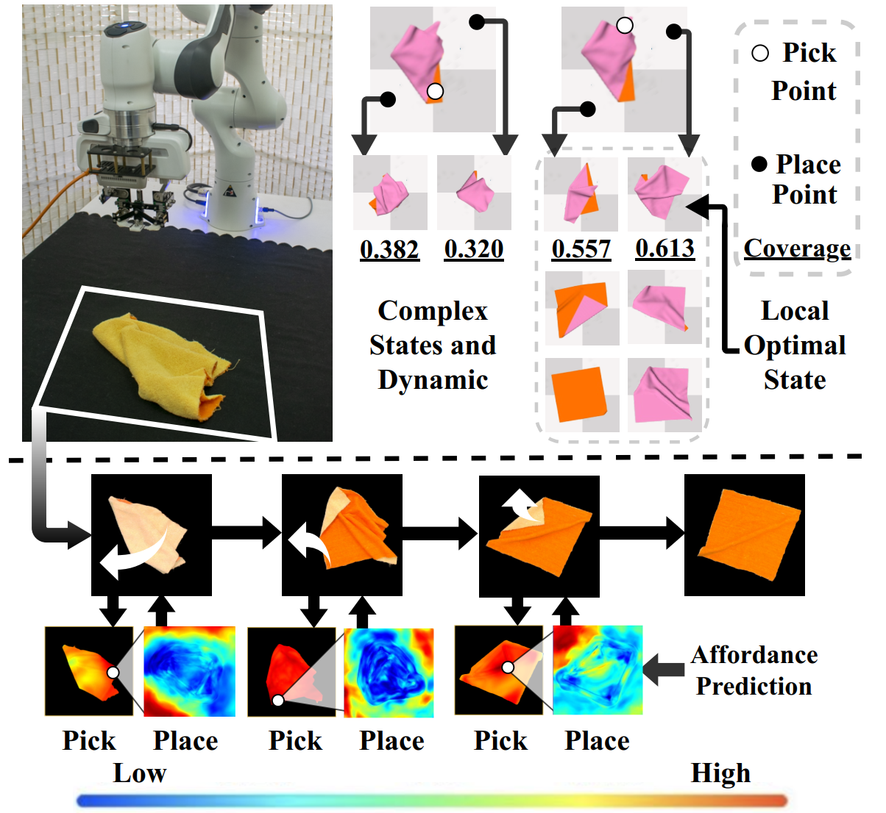

# Learning Foresightful Dense Visual Affordance for Deformable Object Manipulation [ICCV 2023]
This is the official implementation of the paper: [Learning Foresightful Dense Visual Affordance 
for Deformable Object Manipulation](https://hyperplane-lab.github.io/DeformableAffordance/) (ICCV 2023).

[Project](https://hyperplane-lab.github.io/DeformableAffordance/) | [Paper](https://arxiv.org/pdf/2303.11057.pdf) | [Arxiv](https://arxiv.org/pdf/2303.11057.pdf) | [Video](https://youtu.be/DiZ9aXjK_PU) | [Video (real world)](https://youtu.be/aYneBzwhOGs)



## Environment Installation
Please refer to https://github.com/Xingyu-Lin/softgym for SoftGym Installation Instructions.
## Collect Data
Collecting data for task **SpreadCloth**, please run 
```
bash scripts/collect_cloth-flatten.sh
```
Collecting data for task **RopeConfiguration**, please run 
```
bash scripts/collect_rope-configuration.sh
```
## Train Models
Our models are trained in a reversed step-by-step manner. We prepare some bash files to handle the training process.

To train models for **SpreadCloth**, pleas run
```
bash scripts/train_cloth-flatten.sh
```

To train models for **RopeConfiguration**, pleas run
```
bash scripts/train_rope-configuration.sh
```
## Test Models
We prepare some bash files to test the final model. you can easily change the argument to test our other models mentioned in our paper.

To test models for **SpreadCloth**, pleas run
```
bash scripts/test-cloth-flatten.sh
```

To test models for **RopeConfiguration**, pleas run
```
bash scripts/test-rope-configuration.sh
```

The manipulation result (gif) will be stored in "test_video" directory.

## Citation
If you find this paper useful, please consider citing:
```
@inproceedings{wu2023learning,
  title={Learning Foresightful Dense Visual Affordance for Deformable Object Manipulation},
  author={Wu, Ruihai and Ning, Chuanruo and Dong, Hao},
  booktitle={IEEE International Conference on Computer Vision (ICCV)},
  year={2023}
}
```

## Contact
If you have any questions, please feel free to contact [Ruihai Wu](https://warshallrho.github.io/) at wuruihai_at_pku_edu_cn and [Chuanruo Ning](https://tritiumr.github.io/) at chuanruo_at_stu_pku_edu_cn
